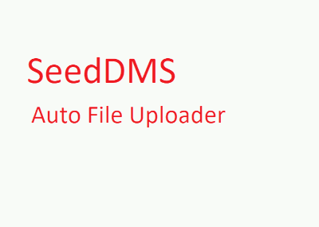

# SeeddmsAutoFileUploader - Program Seeddms Auto File Uploader
========================

## 1. Introduction
You can easily edit document by your default editor by clicking the link on document on Seeddms 
document management system web application. 
User download document for example Word (docx), edit it. Save and close Word application. 
Client Seeddms Auto File Uploader detect this change and automatically upload document on 
Seeddms web application and create new version of Word document.


## 2. Install
First you have to patch SeedDms php code on server and install client on Windows PC.

### 2.1 Install on server

#### 2.1.1 Edit “class.ViewDocument.php” file
Correct path of document is here:
```
seeddms-6.0.13/views/bootstrap/class.ViewDocument.php
```

After this line:
```
$this->htmlAddHeader('<script type="text/javascript" src="../styles/'.$this->theme.'/timeline/timeline-locales.js"></script>'."n", 'js');
```
Add this:
```
$this->htmlAddHeader('<script type="text/javascript" src="../styles/'.$this->theme.'/sorli/sorli.js"></script>'."n", 'js'); 
$this->htmlAddHeader('<script type="text/javascript" src="../styles/'.$this->theme.'/jquery/jquery-ui.min.js"></script>'."n", 'js'); 
$this->htmlAddHeader('<link href="../styles/'.$this->theme.'/jquery/jquery-ui.css" rel="stylesheet">'."n", 'css');
```
And after this line:
```
print "<li><a href="../op/op.Download.php?documentid=".$latestContent->getDocument()->getId()."&version=".$latestContent->getVersion().""> <i class="fa fa-download"></i>".getMLText("download")."</a></li>"; 
```
Add this:
```
$actual_link = (isset($_SERVER['HTTPS']) && $_SERVER['HTTPS'] === 'on' ? "https" : "http") . "://$_SERVER[HTTP_HOST]". dirname($_SERVER['PHP_SELF']);
$actual_link = substr_replace($actual_link, '', -4);
print '<input type="hidden" id="sorliId" name="sorliId" value="' . "sorli://" . $actual_link . "/op/op.Download.php?documentid=".$latestContent->getDocument()->getId()."&version=".$latestContent->getVersion(). '">';
print '<li><a id="opendocumentviasorli" class="opendocumentviasorli" href="" value=' . "sorli://" . $actual_link . "/op/op.Download.php?documentid=".$latestContent->getDocument()->getId()."&version=".$latestContent->getVersion() . '"><i class="fa fa-edit"></i>'.getMLText("edit").'</a></li>';
print '<div id="dialogsorli" title="Refresh" hidden="hidden">After close document via Auto File Uploader please cilick ok to refresh page.</div>';
```

Create directory sorli and file sorli.js like here:
```
seeddms-6.0.13/styles/bootstrap/sorli/sorli.js
```
Paste code in file:
```
 $( document ).ready(function() {
 $( "#dialogsorli" ).dialog({
    autoOpen : false, modal : true, show : "none", hide : "none",   buttons : {
        "Refresh" : function() {
            location.reload();   
            $(this).dialog("close");
        }
      }
  });
});

window.onload = function what()
{
$("a.opendocumentviasorli").click(function() { 
    window.open(document.getElementById("sorliId").value);
    $("#dialogsorli").dialog('open');
    return false;
});
}
```
Paste jQuery files from https://jqueryui.com/download/all/ to seeddms directory
```
seeddms-6.0.13/styles/bootstrap/jquery/jquery-ui.min.js
seeddms-6.0.13/styles/bootstrap/jquery/jquery-ui.css
seeddms-6.0.13/styles/bootstrap/jquery/images/ui-bg_flat_0_aaaaaa_40x100.png
seeddms-6.0.13/styles/bootstrap/jquery/images/ui-bg_flat_75_ffffff_40x100.png
seeddms-6.0.13/styles/bootstrap/jquery/images/ui-bg_glass_75_e6e6e6_1x400.png
seeddms-6.0.13/styles/bootstrap/jquery/images/ui-bg_highlight-soft_75_cccccc_1x100.png
seeddms-6.0.13/styles/bootstrap/jquery/images/ui-icons_222222_256x240.png
```
Files can be downloaded here:[Click here to download files](https://github.com/developersorli/SeeddmsAutoFileUploader/raw/main/server%20patch/release/replace.zip)


### 2.2 Install on PC

Download new version (stable v.1.0.2) and install it.
[Click here to download Setup](https://github.com/developersorli/SeeddmsAutoFileUploader/raw/main/client/SetupSeeddmsAutoFileUploader/bin/Release/SetupSeeddmsAutoFileUploader.msi)

## 3 How to usage it
After install pc client you can test it by clicking on the link
Click here to Test plugin: sorli://about

